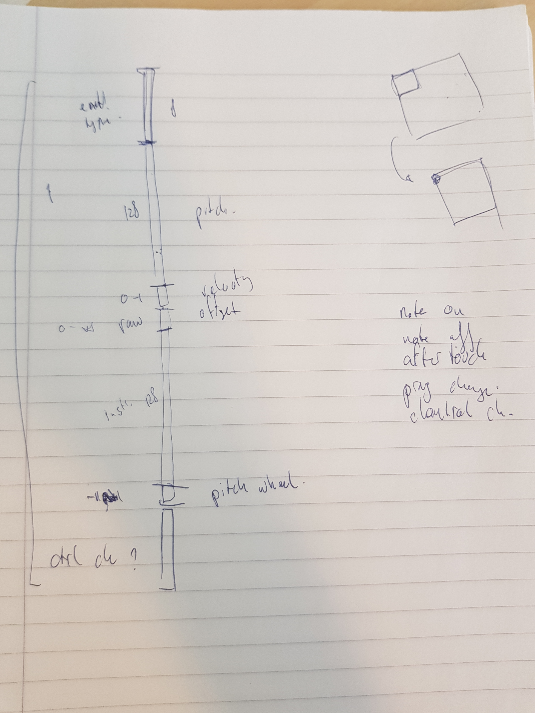

# midi2vec

</img>

todo:
- summary of uses of control change events
- preselect "important" control change events we want to take into account
- extend MIDI SPARQL/API to boler plate set of increasingly complex MIDIs
